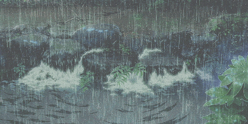

<!-- ===== BANNER ===== -->

  <!-- Background GIF -->
  
  <!-- Foreground GIF -->
  

<!-- ===== BAŞLIK ===== -->
<h1 align="center">
  💻 Merhaba, ben <strong>Emre</strong> 🚀
</h1>

<!-- ===== TEKNOLOJİLER & ÖĞRENİYOR ===== -->

  🛠️ <strong>Teknolojiler:</strong>
  <code>Web Programlama</code>,
  <code>Python</code>,
  <code>Java</code>,
  <code>C</code>,
  <code>Flutter</code>,
  <code>Firebase</code> 
  🌱 <strong>Öğreniyorum:</strong> React, AI, ML  

